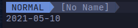

# first-plugin
first neovim plugin written in python

## Installation
If for some reason you want to install this you must need.
- pynvim installed
- neovim installed
- A plugin manager for neovim

Assuming you're using [vim plug](https://github.com/junegunn/vim-plug)
Add `Plug 'nerdthatnoonelikes/first-plugin'` to where you define your plugins.

## Using
There is one command `:Date` it will print out something like this 

